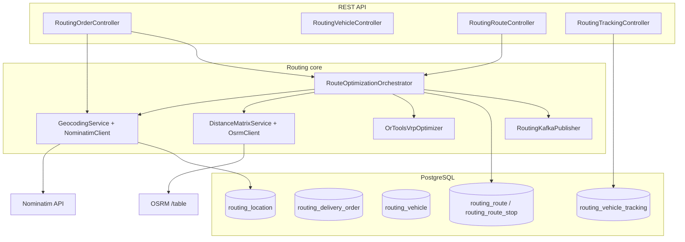

# TMS Route Optimization Module

Production-oriented **route planning** inside the existing **TMS EDI Platform** (Spring Boot). Uses only **free / open-source** external services:

| Capability | Technology |
|------------|------------|
| Geocoding | [OpenStreetMap Nominatim](https://nominatim.org/) |
| Road distance / time matrix | [OSRM](http://project-osrm.org/) (self-hosted) |
| VRP solver | [Google OR-Tools](https://developers.google.com/optimization) (Apache-2.0) |
| Persistence | PostgreSQL (+ optional PostGIS for future spatial queries) |

Paid map APIs (Google Maps, Mapbox, HERE, etc.) are **not** used.

---

## Architecture (modular monolith)

Services are **Java packages** with clear boundaries (`com.tms.edi.routing.*`). They can be extracted into separate deployables later without changing domain logic.



---

## Data flow (happy path)

```mermaid
sequenceDiagram
  participant FE as Dashboard / TMS UI
  participant API as Spring Boot
  participant N as Nominatim
  participant O as OSRM
  participant DB as PostgreSQL
  participant OR as OR-Tools
  FE->>API: POST /routing/orders
  API->>DB: save routing_delivery_order
  FE->>API: POST /routing/routes/optimize
  API->>DB: load orders + vehicles
  loop each address
    API->>DB: routing_location cache hit?
    alt miss
      API->>N: search q=address
      N-->>API: lat, lon
      API->>DB: insert routing_location
    end
  end
  API->>O: GET /table/v1/driving/{lon,lat};...
  O-->>API: durations[][], distances[][]
  API->>OR: VRP pickup-delivery + capacity
  OR-->>API: per-vehicle node sequences
  API->>DB: routing_route + routing_route_stop
  FE->>API: GET /routing/routes/{id}
```

---

## Routing algorithm (OR-Tools)

1. **Build a node list**: depot (index `0`), then for each order a **pickup** node and a **delivery** node (`1+2k`, `2+2k`).
2. **Distance matrix**: from OSRM `table` API when `tms.routing.osrm-enabled=true`; otherwise **Haversine** great-circle distance × `haversine-road-factor`, with travel time = distance / average speed.
3. **Demands** (capacity dimension): `+weight` at pickup, `-weight` at delivery, `0` at depot (load conserved).
4. **Constraints**:
   - `addPickupAndDelivery` for each order.
   - Same vehicle for pickup and delivery; pickup before delivery on the distance dimension.
   - `addDimensionWithVehicleCapacity` with per-vehicle max weight.
5. **Objective**: minimize total travel distance (arc costs from distance matrix).
6. **Metaheuristic**: `PARALLEL_CHEAPEST_INSERTION` + `GUIDED_LOCAL_SEARCH` with a configurable time limit.

Time windows from the order DTO are stored and exposed for **future** tightening of the OR-Tools time dimension (service time is already configurable in `application.yml`).

---

## Integration with existing TMS orders

TMS orders already expose a full **order card** via `GET /api/v1/tms-orders/{orderNo}`.

To feed routing:

`POST /api/v1/routing/orders/from-tms/{orderNo}`

- Uses **line 1** as pickup (`address_no` → `tms_address`) and **line 2** as delivery.
- Sums **cargo gross weight** for `weight_kg`.
- Copies requested date/time windows when present.
- Sets `tms_order_id` / `tms_order_no` for traceability.

---

## HTTP API summary

| Method | Path | Description |
|--------|------|-------------|
| POST | `/api/v1/routing/orders` | Create standalone planning order |
| GET | `/api/v1/routing/orders` | List orders |
| GET | `/api/v1/routing/orders/{id}` | Get order |
| POST | `/api/v1/routing/orders/from-tms/{orderNo}` | Import from TMS order card |
| POST | `/api/v1/routing/vehicles` | Register vehicle |
| GET | `/api/v1/routing/vehicles` | List active vehicles |
| GET | `/api/v1/routing/vehicles/{id}` | Get vehicle |
| POST | `/api/v1/routing/routes/optimize` | Geocode → matrix → OR-Tools → persist |
| GET | `/api/v1/routing/routes` | List planned routes |
| GET | `/api/v1/routing/routes/{id}` | Route + stops |
| POST | `/api/v1/routing/tracking/{vehicleId}` | Driver GPS ping |
| GET | `/api/v1/routing/tracking/{vehicleId}` | Recent positions |

All endpoints require JWT (same as rest of platform): **GET** allowed for `VIEWER`; **mutations** for `OPERATOR` / `ADMIN`.

---

## Configuration (`application.yml`)

```yaml
tms:
  routing:
    nominatim-user-agent: TMS-RoutePlanner/1.0 (you@company.com)  # required by OSM policy
    osrm-base-url: http://localhost:5000
    osrm-enabled: true
```

If `osrm-enabled: false` or OSRM is unreachable, the **Haversine fallback** keeps the stack usable for dev/tests.

---

## Docker Compose

`docker-compose.routing.yml` (repository root) provides:

- **PostGIS** on host port `5433` (avoids clashing with a local 5432).
- **OSRM** (profile `osrm`) — you must supply processed `.osrm` files under the `osrm_data` volume.
- **Kafka + Zookeeper** (profile `kafka`) — optional; enable Spring Kafka auto-config when ready.

Examples:

```bash
docker compose -f docker-compose.routing.yml up -d postgres-routing
docker compose -f docker-compose.routing.yml --profile osrm up -d
docker compose -f docker-compose.routing.yml --profile kafka up -d
```

---

## Example JSON payloads

See `backend/src/main/resources/examples/`:

- `routing-order.json`
- `routing-vehicle.json`
- `routing-optimize-request.json`

---

## Example optimization scenario

**Input**

- Depot: Copenhagen area `(55.6761, 12.5683)`.
- 3 orders (pickup → delivery around Zealand), weights 500 kg, 800 kg, 300 kg.
- 2 trucks, 12 t capacity each.

**Expected shape of output**

- **Vehicle 1**: `DEPOT → PICKUP(order A) → DELIVERY(order A) → PICKUP(order C) → … → DEPOT`
- **Vehicle 2**: similar, respecting capacities and pickup-before-delivery.

Exact sequences depend on coordinates and matrix data.

---

## Scale & operations

- **Geocoding**: cache keyed by normalized `address|postcode` in `routing_location` — critical for thousands of orders/day (respect Nominatim rate limits or run a **private Nominatim** instance).
- **OSRM**: horizontally scale **stateless** `osrm-routed` behind a load balancer; partition by region if the world-wide graph is too large for one machine.
- **OR-Tools**: time-box search (`optimizer-time-limit-seconds`); shard by **depot + day** for very large instances.
- **Kafka** (optional): after a successful `POST /routing/routes/optimize`, see **Kafka events** below.

---

## Time windows (OR-Tools)

- A **Time** dimension uses the OSRM (or Haversine) **duration matrix** plus **service time** at each pickup/delivery node (`tms.routing.service-time-seconds`).
- **Waiting** is allowed up to `tms.routing.time-slack-seconds` so vehicles can arrive early and wait for a window.
- **Horizon**: all cumulative times are capped by `tms.routing.time-horizon-seconds` (default 48h from planning-day midnight).
- Order `timeWindowStart` / `timeWindowEnd` (`OffsetDateTime`) are converted to seconds since **`routeDate` at start of day** in `tms.routing.routing-time-zone-id` (default `UTC`). If both are absent, stops use the full horizon (no narrow TW).
- Depot departures are allowed in `[0, min(86400, horizon)]` on that dimension; pickup/delivery ordering is enforced on **both** Distance and Time cumulatives.

---

## Kafka events

1. Remove `KafkaAutoConfiguration` from `spring.autoconfigure.exclude` in `application.yml` when you want Kafka (or manage beans manually).
2. Set `spring.kafka.bootstrap-servers` and `tms.routing.kafka-enabled: true`.
3. Topic: `tms.routing.kafka-topic` (default `tms.routing.routes-planned`).
4. Payload: JSON `RoutesPlannedEvent` — `eventType`, `optimizerRunId`, `routeIds`, `vehicleIds`, `orderIds`, `routeDate`, `plannedAt` (ISO-8601).

If `KafkaTemplate` is missing or `kafka-enabled` is false, publishing is skipped (no error).

---

## Web UI (React + Leaflet)

- **Route**: `/route-planner` (sidebar: **Route planner**).
- Lists routing orders & vehicles, **import from TMS** order number, **run optimize**, pick a planned route and view **OSM tiles**, **polyline**, and **markers** with popups (arrival times when stored).
- Uses the same JWT proxy as the rest of the app (`/api` → backend).

Tile usage: follow the [OSMF tile policy](https://operations.osmfoundation.org/policies/tiles/) for production volume; swap `TileLayer` `url` for your own tile server if needed.
